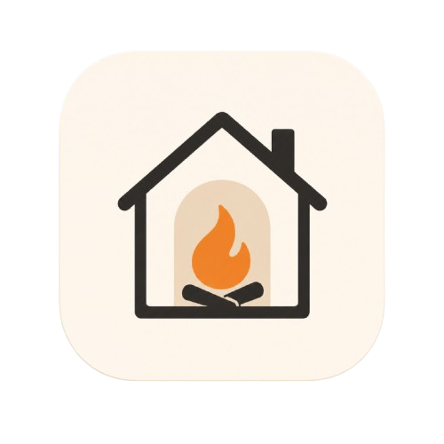

<p align="center">
  
</p>

<h1 align="center">Hearth</h1>

<p align="center">
  Aplikacija za organizaciju domaćinstva — zajednički zadaci, lista za kupovinu
  i obaveštenja u realnom vremenu, za sve ukućane.
</p>

---

## Funkcionalnosti

- **Nalozi i prijava** — registracija i login, JWT autentifikacija.
- **Domaćinstvo** — kreiranje domaćinstva ili pridruživanje kodom od 6 karaktera;
  dva koda po domaćinstvu (kod za odrasle i kod za decu) određuju ulogu člana.
- **Uloge** — `Adult` (pun pristup) i `Child` (ograničeno: ne može da menja,
  dodeljuje ni briše zadatke; status menja samo na zadatku koji mu je dodeljen).
- **Zadaci** — CRUD, prioritet, rok, dodela članu, state machine statusa
  (`ToDo → InProgress → Done`, sa dozvoljenim vraćanjem).
- **Lista za kupovinu** — zajednička za domaćinstvo; stavke sa količinom,
  `Needed`/`Bought` status, beleži se ko je i kada kupio.
- **Notifikacije** — svaka bitna akcija (nova stavka, kupovina, nov zadatak,
  dodela) obaveštava ostale članove:
  - **uživo** preko SignalR-a dok je aplikacija otvorena (toast + zvonce),
  - **Web Push** sistemskom notifikacijom kad je aplikacija zatvorena,
  - istorija sa označavanjem pročitanog.
- **PWA frontend** — React aplikacija koja se instalira na telefon
  (manifest, service worker, offline shell).

## Tehnologije

| Sloj | Tehnologije |
|---|---|
| Backend | .NET 10, ASP.NET Core, EF Core 10 (PostgreSQL/Npgsql), ASP.NET Identity, MediatR, FluentValidation, SignalR, WebPush |
| Frontend | React 19 + TypeScript, Vite, Tailwind CSS 4, TanStack Query, React Router, `@microsoft/signalr`, `vite-plugin-pwa` |
| Baza | PostgreSQL |
| Deploy | Docker (multi-stage), Railway |

## Arhitektura (ukratko)

Clean Architecture sa CQRS-om — zavisnosti idu isključivo ka unutra:

```
Hearth.Api  ──▶  Hearth.Infrastructure  ──▶  Hearth.Application  ──▶  Hearth.Domain
(kontroleri,     (EF Core, Identity,         (use case-ovi/CQRS,      (entiteti,
 SignalR hub)     repozitorijumi, servisi)    interfejsi, validacija)   enumi, pravila)
```

- **Domain** — entiteti i poslovna pravila, bez ijedne zavisnosti.
- **Application** — vertikalni slice-ovi (`Features/{Oblast}/{Akcija}`) sa
  MediatR command/query + handler + FluentValidation validatorom; definiše
  interfejse (`IUnitOfWork`, `IIdentityService`, `IRealtimeNotifier`…) koje
  spoljni slojevi implementiraju. `Result<T>` obrazac za poslovne ishode.
- **Infrastructure** — EF Core (`AppDbContext`, migracije), Repository + Unit of
  Work implementacije, Identity, JWT, Web Push.
- **Api** — tanki kontroleri (samo `ISender.Send`), SignalR hub, mapiranje
  `Result` → HTTP status. U produkciji servira i frontend (SPA fallback).

Detaljnije: [docs/ODBRANA.md](docs/ODBRANA.md).

## Pokretanje lokalno

Preduslovi: **.NET 10 SDK**, **Node 20+**, **PostgreSQL**.

```powershell
# 1) Tajne za razvoj (jednom)
dotnet user-secrets set "ConnectionStrings:DefaultConnection" "Host=localhost;Database=hearth;Username=postgres;Password=<lozinka>" --project Hearth.Api
$key = New-Object byte[] 48; [Security.Cryptography.RandomNumberGenerator]::Create().GetBytes($key)
dotnet user-secrets set "Jwt:Key" ([Convert]::ToBase64String($key)) --project Hearth.Api

# (opciono, za Web Push) VAPID ključevi:  npx web-push generate-vapid-keys
dotnet user-secrets set "Vapid:Subject" "mailto:tvoj@email.com" --project Hearth.Api
dotnet user-secrets set "Vapid:PublicKey" "<public>" --project Hearth.Api
dotnet user-secrets set "Vapid:PrivateKey" "<private>" --project Hearth.Api

# 2) Backend (migracije se primenjuju automatski pri startu)
dotnet run --project Hearth.Api        # http://localhost:5245 (Scalar UI: /scalar)

# 3) Frontend
cd hearth-web
npm install
npm run dev                            # http://localhost:5173 (proxy ka backendu)
```

Web Push zahteva service worker koji postoji samo u production buildu — lokalno
se testira sa `npm run build && npm run preview` (port 4173, proxy podešen).

## Deploy (Railway)

Repo sadrži [Dockerfile](Dockerfile) koji builduje frontend, objavljuje backend
i servira sve sa jednog hosta (bez CORS-a, SignalR same-origin). Na Railway-u:

1. **New Project → Deploy from GitHub repo** (Dockerfile se detektuje sam).
2. **+ New → Database → PostgreSQL** u istom projektu.
3. Promenljive na app servisu:

   | Promenljiva | Vrednost |
   |---|---|
   | `DATABASE_URL` | `${{Postgres.DATABASE_URL}}` (referenca) |
   | `Jwt__Key` | novi base64 ključ (≥ 48 bajtova) |
   | `Vapid__Subject` | `mailto:…` |
   | `Vapid__PublicKey` / `Vapid__PrivateKey` | VAPID par |

4. **Settings → Networking → Generate Domain** → HTTPS adresa, spremna za
   instalaciju PWA na telefon.

Migracije i seed uloga izvršavaju se automatski pri startu aplikacije.

## Pregled API-ja

| Ruta | Opis |
|---|---|
| `POST /api/auth/register`, `POST /api/auth/login` | registracija/prijava → JWT |
| `POST /api/households`, `POST /api/households/join`, `GET /api/households/members` | domaćinstvo i članovi |
| `GET/POST /api/tasks`, `PUT /api/tasks/{id}`, `PUT …/status`, `PUT …/assign`, `DELETE …` | zadaci |
| `GET/POST /api/shopping`, `PUT /api/shopping/{id}`, `PUT …/status`, `DELETE …` | kupovina |
| `GET /api/notifications`, `PUT …/{id}/read`, `PUT …/read-all` | istorija obaveštenja |
| `GET /api/push/public-key`, `POST /api/push/subscribe`, `POST /api/push/unsubscribe` | web push |
| `WS /hubs/notifications` | SignalR (event `ReceiveNotification`) |
